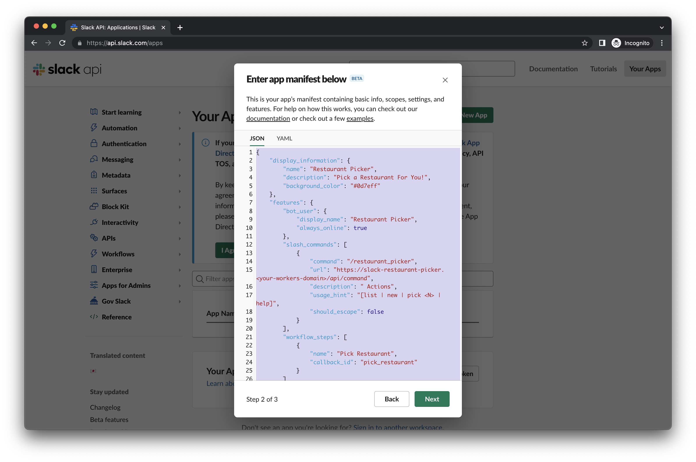

# Slack Restaurant Picker

## Overview
This is a ready-to-use Slack app that helps your team pick destinations for your coming meal. A vote mechanism is included to make everyone happy. Restaurants can be weighted so the choices fit your preference more.

This project aims to make the app free of charge and easy to maintain, by leveraging Cloudflare Workers free plan as the web server and exploiting Slack conversation bookmark as the data storage.

## Features
1. Add / Update / Remove restaurants
2. Adjust restaurant weighting
3. Pick 1 or more restaurants using weighted random selection
4. Vote anonymously for the picked restaurants
5. View vote results
6. View cumulative statistics (e.g., win rate) so you can understand your team's preference more
7. Scheduled execution with Slack Workflow integration
8. _[Privacy Bonus]_ No data stored outside of the Slack conversation

## Setup
The setup involves two components, creating a Slack app and a Cloudflare Workers.

### Prerequisites
1. A Slack account in a workspace, with permissions to
    - create an app
    - install an app
2. A Cloudflare account, with permissions to
    - create a Workers
    - change the Workers domain _(Optional)_
3. Node.js and npm installed on your machine

### Steps
1. Clone this repository to your machine, with either
    - Github Desktop or any other Git client
    - `git clone https://github.com/Kit-p/Slack-Restaurant-Picker.git`
2. Sign in to your Cloudflare account in a web browser, by visiting <https://dash.cloudflare.com/login>.
    
3. Expand "Workers & Pages" section inside the left sidebar and click "Overview".
4. _[Optional]_ Click "Change" next to the "Your subdomain" section inside the right sidebar to modify your Cloudflare Workers domain. You may use the default one provided or later on add a custom domain that does not end in "workers.dev" (not covered here).
5. Replace the domain part of the `APP_ENDPOINT` environment variable in `wrangler.toml` and the domain part of all the urls __(BEFORE `/api/*`)__ in `manifest.jsonc`, with your Cloudflare Workers domain.
    
6. Replace the `account_id` field in `wrangler.toml` with your Cloudflare account ID.
    
7. Open a terminal in the project folder, and execute the following commands in order, to deploy the Cloudflare Workers.
    1. `npm install` (installs project dependencies)
    2. `npx wrangler login` (look at the output and authenticate with your Cloudflare account)
    3. `npx wrangler publish`
8. Confirm that the Cloudflare Workers has been deployed in the dashboard.
    
9. Sign in to your Slack account in a web browser, usually by visiting <https://your-workspace-slug.slack.com>.
    
10. Visit <https://api.slack.com/apps> and click "Create new app" at the top right corner.
    
11. Click on "From an app manifest".
    
12. Select the Workspace where you want to create the app. Then, click "Next".
    
13. Remove all the `// EDIT` in `manifest.jsonc` _(make sure you did actually replace the domain with your Cloudflare Workers domain as in step 5)_, copy __EVERYTHING__ in the file, and replace the example manifest. Then, click "Next".
    
14. Click "Create".
    
15. Confirm that the Slack App has been created in the dashboard.
    
16. Add the app to your workspace and invite it to a channel. Type `/restaurant_picker help` to see all the available commands. Hurray!
17. _[Optional]_ Create a Workflow using the Workflow Builder for a scheduler execution.
